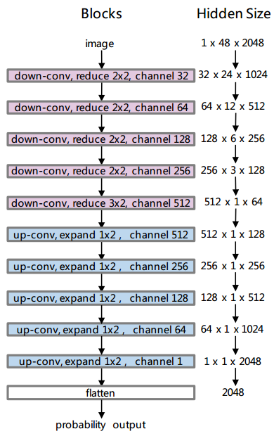
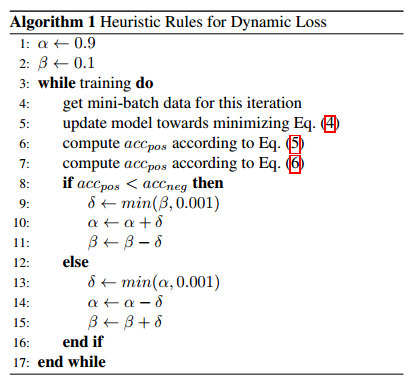
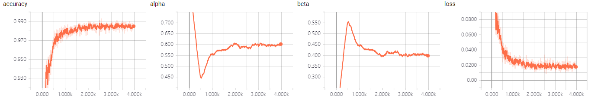
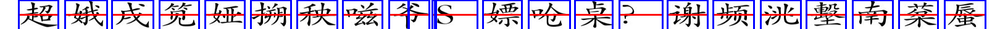

# Character Segmentation
Segment characters and spaces in one text line,from this paper [Chinese English mixed Character Segmentation as Semantic Segmentation](https://arxiv.org/pdf/1611.01982.pdf)

## dependencies
tensorflow1.3,or 1.4
> 

## differences from the paper
the paper set the label of the space to 1,others 0.But that is not hommizate,because the space between two characters is many pixes,the network is hard to distinguish which is 1,which is 0,even though it can work.Here we change to set the characters to 1,spaces to 0.

python3 

## architecture of the network

## Heuristic Rules for balanced_Binary_CrossEntropy

## make training images and labels
    python3 make_train_images.py

## train
    python3 train_char_seg.py

## test
    python3 test_char_seg.py

## other_things
you can choose first make traing images and then use these maked images to train ,or training and making at the same time.all you need to do is change below codes in data_generator.py
> 
    enqueuer = GeneratorEnqueuer(generator_on_the_fly(**kwargs), use_multiprocessing=False)
    #enqueuer = GeneratorEnqueuer(generator_from_folder(**kwargs), use_multiprocessing=False)